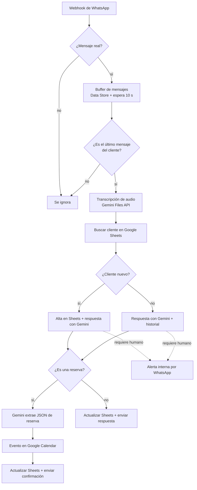

# 🤖 Chatbot de WhatsApp con IA para restaurantes (Make + Gemini)


Asistente virtual para WhatsApp que atiende clientes de un restaurante 24/7: responde consultas (menú, horarios, delivery), entiende **mensajes de voz**, toma **reservas** y las agenda en Google Calendar, recuerda el historial de cada cliente y **avisa a un humano** cuando el caso lo requiere.

Todo el flujo está construido sin código en **Make.com**, usando la API oficial de WhatsApp Business Cloud y **Google Gemini** como modelo de lenguaje.

> **EN:** WhatsApp AI chatbot for restaurants built with Make.com, Google Gemini, WhatsApp Business Cloud API, Google Sheets and Google Calendar. It transcribes voice notes, keeps per-customer conversation history, books tables into Google Calendar, groups rapid-fire messages (debounce) and escalates to a human when needed. The restaurant in the prompts ("Sabores de Puerto") is a fictional demo business.

---

## ✨ Funcionalidades

- **Conversación natural en español rioplatense**, con el tono y las reglas del negocio definidas en el prompt del sistema.
- **Mensajes de voz:** el audio se sube a la Files API de Gemini y se transcribe antes de responder.
- **Memoria por cliente:** el historial de cada número se guarda en Google Sheets para no repetir preguntas.
- **Reservas automáticas:** Gemini extrae nombre, fecha, hora y cantidad de personas en formato JSON y se crea el evento en Google Calendar (con teléfono y cantidad de personas en la descripción).
- **Agrupación de mensajes (debounce):** si el cliente manda varios mensajes seguidos, se guardan en un buffer y solo la última ejecución responde, con todo el contexto junto.
- **Derivación a un humano:** ante alergias, reclamos, devoluciones, grupos grandes, información desconocida o un pedido explícito de hablar con una persona, el bot avisa internamente por WhatsApp a un encargado.
- **Mensaje de resguardo:** si Gemini falla (sobrecarga o cuota), el cliente igual recibe una respuesta en lugar de quedarse sin contestación.
- **Filtro de eventos de estado:** los webhooks de estado de WhatsApp (entregado, leído) no disparan el flujo.

## 🧩 Arquitectura



## 🛠️ Stack

| Componente | Rol |
|---|---|
| Make.com | Orquestación del flujo (webhooks, routers, filtros, manejo de errores) |
| WhatsApp Business Cloud API | Canal de mensajería (entrada y salida, descarga de audios) |
| Google Gemini AI | Transcripción de audio, respuestas al cliente y extracción de reservas en JSON |
| Google Sheets | Base de clientes e historial de conversaciones |
| Google Calendar | Agenda de reservas |
| Make Data Store | Buffer temporal para agrupar mensajes consecutivos |

## 📁 Contenido del repositorio

```
.
├── README.md
└── blueprint/
    └── scenario-blueprint.json   # Escenario de Make exportado y sanitizado
```

## 🚀 Cómo probarlo

1. Importá `blueprint/scenario-blueprint.json` en Make (*Create a new scenario → ⋯ → Import Blueprint*).
2. Creá las conexiones y reconectá cada módulo: WhatsApp Business Cloud, Google Gemini AI, Google Sheets y Google Calendar.
3. Creá un **Data Store** para el buffer con los campos `telefono`, `mensajes` y `ultima_actualizacion`, y seleccionalo en los módulos de Data Store.
4. Creá la hoja de Google Sheets con estas columnas en la fila 1: `Teléfono`, `Fecha`, `Primer mensaje`, `Historial`, `Nombre`, `Preferencias/Alergias`, `Última interacción`, `Notas`.
5. Reemplazá los marcadores del blueprint: `YOUR_SPREADSHEET_ID`, `YOUR_CALENDAR@gmail.com`, `YOUR_WHATSAPP_PHONE_NUMBER_ID` y `+598XXXXXXXX` (número interno que recibe las alertas).
6. Copiá la URL del webhook de Make en la configuración de tu app de Meta for Developers y activá el escenario.

> ⚠️ El blueprint está **sanitizado**: no incluye conexiones, tokens, IDs de cuentas ni datos de clientes.

## 🧠 Decisiones de diseño

- **Debounce con Data Store:** cada mensaje de WhatsApp dispara una ejecución independiente. Sin agrupación, el bot respondía a cada mensaje por separado y perdía contexto. El buffer + espera corta asegura que responda una sola vez con todo lo que escribió el cliente.
- **Router con filtros explícitos:** la extracción de reserva solo corre cuando la respuesta del bot confirma una reserva. Antes corría siempre y rompía el flujo con fechas inválidas.
- **Fechas con zona horaria explícita:** todas las fechas usan `America/Montevideo` para evitar desfases de UTC en Calendar y en el prompt.
- **Datos de cliente opcionales y no invasivos:** el bot nunca interroga; solo guarda nombre, preferencias o cumpleaños si el cliente los menciona espontáneamente.

## 🗺️ Próximos pasos

- [ ] Recordatorio automático por WhatsApp 24 h antes de la reserva, con botones para confirmar o cancelar.
- [ ] Reintentos automáticos y alerta interna cuando Gemini no responde.
- [ ] Panel simple para ver reservas y conversaciones derivadas.

## ℹ️ Nota

El restaurante "Sabores de Puerto", sus platos, precios, dirección y teléfono son **datos ficticios de demostración**. Para usar el bot con un negocio real, reemplazá la información del prompt del sistema en los módulos de Gemini.

---

Desarrollado por [@camirodridevelop](https://github.com/camirodridevelop).
