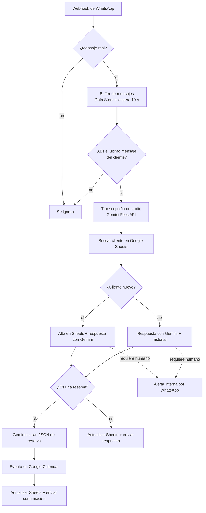

# 🤖 Chatbot de WhatsApp con IA para restaurantes (Make + Gemini)


Asistente virtual para WhatsApp que atiende clientes de un restaurante 24/7: responde consultas (menú, horarios, delivery), entiende **mensajes de voz**, toma **reservas** y las agenda en Google Calendar, recuerda el historial de cada cliente y **avisa a un humano** cuando el caso lo requiere.

Todo el flujo está construido sin código en **Make.com**, usando la API oficial de WhatsApp Business Cloud y **Google Gemini** como modelo de lenguaje.

> **EN:** WhatsApp AI chatbot for restaurants built with Make.com, Google Gemini, WhatsApp Business Cloud API, Google Sheets and Google Calendar. It transcribes voice notes, keeps per-customer conversation history, books tables into Google Calendar, groups rapid-fire messages (debounce) and escalates to a human when needed. The restaurant in the prompts ("Sabores de Puerto") is a fictional demo business.

---

## ✨ Funcionalidades

- **Conversación natural en español rioplatense**, con el tono y las reglas del negocio definidas en el prompt del sistema.
- **Mensajes de voz:** el audio se sube a la Files API de Gemini y se transcribe antes de responder.
- **Memoria por cliente:** el historial de cada número se guarda en Google Sheets para no repetir preguntas.
- **Reservas automáticas:** Gemini extrae nombre, fecha, hora y cantidad de personas en formato JSON y se crea el evento en Google Calendar (con teléfono y cantidad de personas en la descripción).
- **Agrupación de mensajes (debounce):** si el cliente manda varios mensajes seguidos, se guardan en un buffer y solo la última ejecución responde, con todo el contexto junto.
- **Derivación a un humano:** ante alergias, reclamos, devoluciones, grupos grandes, información desconocida o un pedido explícito de hablar con una persona, el bot avisa internamente por WhatsApp a un encargado.
- **Mensaje de resguardo:** si Gemini falla (sobrecarga o cuota), el cliente igual recibe una respuesta en lugar de quedarse sin contestación.
- **Filtro de eventos de estado:** los webhooks de estado de WhatsApp (entregado, leído) no disparan el flujo.

## 🧩 Arquitectura


```mermaid
flowchart TD
    A[Webhook de WhatsApp] --> B{¿Mensaje real?}
    B -- no --> Z[Se ignora]
    B -- sí --> C[Buffer de mensajes<br/>Data Store + espera 10 s]
    C --> D{¿Es el último mensaje<br/>del cliente?}
    D -- no --> Z
    D -- sí --> E[Transcripción de audio<br/>Gemini Files API]
    E --> F[Buscar cliente en Google Sheets]
    F --> G{¿Cliente nuevo?}
    G -- sí --> H[Alta en Sheets + respuesta con Gemini]
    G -- no --> I[Respuesta con Gemini + historial]
    H --> J{¿Es una reserva?}
    I --> J
    J -- sí --> K[Gemini extrae JSON de reserva]
    K --> L[Evento en Google Calendar]
    L --> M[Actualizar Sheets + enviar confirmación]
    J -- no --> N[Actualizar Sheets + enviar respuesta]
    H -. requiere humano .-> P[Alerta interna por WhatsApp]
    I -. requiere humano .-> P
```

## 🛠️ Stack

| Componente | Rol |
|---|---|
| Make.com | Orquestación del flujo (webhooks, routers, filtros, manejo de errores) |
| WhatsApp Business Cloud API | Canal de mensajería (entrada y salida, descarga de audios) |
| Google Gemini AI | Transcripción de audio, respuestas al cliente y extracción de reservas en JSON |
| Google Sheets | Base de clientes e historial de conversaciones |
| Google Calendar | Agenda de reservas |
| Make Data Store | Buffer temporal para agrupar mensajes consecutivos |

## 📁 Contenido del repositorio

```
.
├── README.md
└── blueprint/
    └── scenario-sample.json   # Muestra ilustrativa (3 módulos), no el escenario completo
```

> **Por qué no está el escenario completo:** este proyecto se lo armé a un cliente real, y publicar el blueprint completo (los ~40 módulos con la lógica de reservas, el prompt del negocio, el buffer de mensajes y la derivación a un humano) permitiría copiarlo tal cual, con muy poco trabajo. Para mostrar cómo está armado sin entregar el bot completo, dejo `scenario-sample.json`: una muestra reducida con la misma estructura (webhook → IA → respuesta por WhatsApp) pero sin el resto de la lógica. El diagrama, la explicación de cada decisión y las funcionalidades de más arriba sí describen el sistema completo.

## 🚀 Cómo probar la muestra

`scenario-sample.json` solo tiene el mecanismo central (recibir el mensaje, generar la respuesta con Gemini y contestar por WhatsApp), para que se pueda importar y mirar módulo por módulo sin necesitar el resto del sistema:

1. Importá `blueprint/scenario-sample.json` en Make (*Create a new scenario → ⋯ → Import Blueprint*).
2. Reconectá los dos módulos que necesitan cuenta: Google Gemini AI y WhatsApp Business Cloud.
3. Reemplazá el marcador `YOUR_WHATSAPP_PHONE_NUMBER_ID` por el ID de tu número de WhatsApp Business.
4. Copiá la URL del webhook en la configuración de tu app de Meta for Developers, activá el escenario y escribile al número para probarlo.

> ⚠️ Esta muestra está **sanitizada** además de reducida: no incluye conexiones, tokens, IDs de cuentas ni el prompt real del negocio (usa uno genérico de ejemplo).

## 🧠 Decisiones de diseño

- **Debounce con Data Store:** cada mensaje de WhatsApp dispara una ejecución independiente. Sin agrupación, el bot respondía a cada mensaje por separado y perdía contexto. El buffer + espera corta asegura que responda una sola vez con todo lo que escribió el cliente.
- **Router con filtros explícitos:** la extracción de reserva solo corre cuando la respuesta del bot confirma una reserva. Antes corría siempre y rompía el flujo con fechas inválidas.
- **Fechas con zona horaria explícita:** todas las fechas usan `America/Montevideo` para evitar desfases de UTC en Calendar y en el prompt.
- **Datos de cliente opcionales y no invasivos:** el bot nunca interroga; solo guarda nombre, preferencias o cumpleaños si el cliente los menciona espontáneamente.

## 🗺️ Próximos pasos

- [ ] Recordatorio automático por WhatsApp 24 h antes de la reserva, con botones para confirmar o cancelar.
- [ ] Reintentos automáticos y alerta interna cuando Gemini no responde.
- [ ] Panel simple para ver reservas y conversaciones derivadas.

## ℹ️ Nota

El restaurante "Sabores de Puerto", sus platos, precios, dirección y teléfono son **datos ficticios de demostración**. Para usar el bot con un negocio real, reemplazá la información del prompt del sistema en los módulos de Gemini.

---

Desarrollado por [@camirodridevelop](https://github.com/camirodridevelop).
